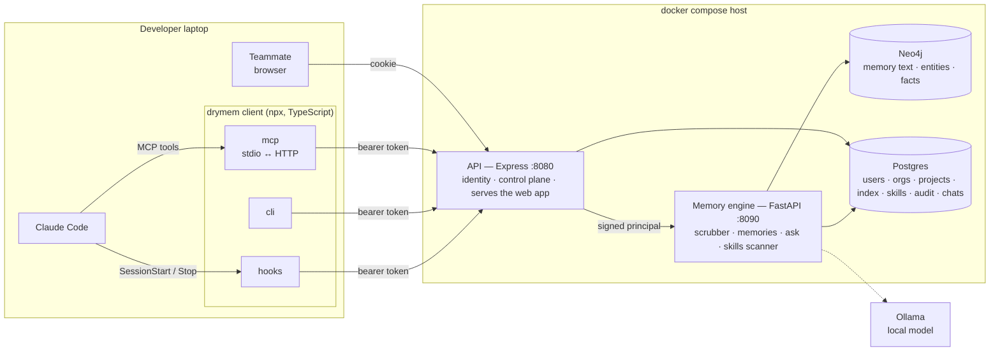

# drymem — Architecture

Companion to [PLAN.md](../PLAN.md). PLAN.md says *what* we build and in what
order; this document says *how the pieces fit*. The pictures live in
[docs/diagrams](diagrams/README.md) — nine archify pages, one per flow — and
are the reviewable version of what is written here.

---

## 1. System overview



**The rule that keeps this honest:** nothing on the laptop imports
`graphiti_core` or a database driver, and no surface (web, MCP, CLI, hooks)
talks to a database. Everything goes through the API over HTTP. The API is the
only published port; the engine listens on the compose network only.

### Component responsibilities

| Component | Owns | Never does |
|---|---|---|
| `apps/web` | The browser UI: memories, sessions, chat, skills, projects, members, audit | Talk to anything but the API |
| `apps/cli` · mcp | Exposing `mem_*` tools to the agent over stdio; forwarding to HTTP | Business logic, storage |
| `apps/cli` · cli | `login`, `setup`, `save`, `search`, `promote`, `import`, `skills …`, `hook …` | Storage |
| `apps/cli` · hooks | What Claude Code fires on session events: context in, skills synced, fallback save | Anything that can fail the session (always exit 0) |
| `apps/api` | Identity (cookie or token), orgs, projects, membership, invites, skills catalogue, chats, audit; mints the signed principal | Touch Neo4j; know how memories are stored |
| `apps/server` · api | Verify the principal, validate, scrub, route | Authenticate people |
| `apps/server` · memory | `MemoryStore` — the only code that knows Graphiti exists | Know about HTTP |
| `apps/server` · extraction, ask, topics | Talk to the local model | Know about HTTP |
| `apps/server` · skills scanner | Refuse credentials, flag findings | Decide who may publish (the API does) |

Skill **content** lives on the server, in the catalogue. Git carries code. The
lockfile under `.drymem/` is a gitignored cache.

---

## 2. One save

`mem_finalize_session` is the hot path. The summary is written by the agent
inside the session; drymem never summarises a transcript.
Picture: [02-save-memory](diagrams/html/02-save-memory.html).

```mermaid
sequenceDiagram
    autonumber
    participant CC as Claude Code
    participant C as drymem mcp
    participant API as API (Express)
    participant E as Engine (FastAPI)
    participant S as scrubber
    participant N as Neo4j
    participant P as Postgres

    CC->>C: mem_finalize_session(summary, topic_key, type)
    C->>API: POST /v1/memories + bearer token
    API->>API: resolve token → sign principal (HS256, short-lived)
    API->>E: forward with X-Drymem-Principal
    E->>S: scrub(summary)
    S-->>E: redacted · or PrivateKeyFound → 422 + audit
    E->>P: ensure_project (first save creates it; saver is lead)
    E->>N: add_episode(group = org/project/u/author) + extraction
    N-->>E: episode_uuid
    E->>P: INSERT memories row (title, type, scope=private, session, topic)
    E->>P: COMMIT — before the response, not after
    E-->>API: 200 {episode_uuid, scrubbed, degraded}
    API-->>C: 200
```

Two rules the arrows encode. **Scrub first**: a stored secret is searchable,
shared on promotion and fed back into prompts. **Commit before reply**: the
teardown-commit lag made sharing a coin flip until it was moved.
If extraction fails the episode is still saved and the reply says `degraded`.

---

## 3. One answer

Picture: [03-ask](diagrams/html/03-ask.html).

1. The API loads the last turns and the uuids the previous answer cited, and
   forwards the question to the engine.
2. The engine searches graph facts and full-text episodes over exactly
   `readable_groups` = the project's team group + the caller's own group.
   Candidates are scored (graph hit +3, carried +2, word match +1); the top four
   go to the model with author names and dates in prose.
3. Only cited memories come back, renumbered from one; a marker pointing at
   nothing is dropped. No match → no model call, `grounded: false`.
4. The API stores the turn as chat messages ordered by `seq`, not by timestamp.

`make eval` runs real questions against the real model and grades every prompt
rule.

---

## 4. Isolation model

One Neo4j `group_id` per visibility bucket. Group ids carry the organisation, so
two companies tracking the same git remote never share a group:

```
<org8>/<project_key>/team           shared: every project member reads it
<org8>/<project_key>/u/<user8>      private to that person
```

- A read runs over `[team] + [own]`. Never another person's private group, and
  never fetch-everything-then-filter: the database is asked for those groups only.
- **Promotion re-ingests** the episode into the team group and adds
  `team_episode_uuid` to the same index row. The private original stays.
- Postgres holds the index (who, when, project, scope, rating, session); Neo4j
  holds the only copy of the text. A page number needs a total; the graph has
  two episodes for every shared memory and no offset — the index has one row.
- Proven against real Neo4j on all three read paths (`make test-e2e`).

Picture: [06-memory-scope](diagrams/html/06-memory-scope.html) and
[08-memory-lineage](diagrams/html/08-memory-lineage.html).

---

## 5. Trust boundaries

1. **Laptop → API.** Cookie (with `X-Drymem-Client`) or bearer token per
   machine; login and signup are rate-limited. A project you are not a member
   of is a 404, not a 403.
2. **API → engine.** The API mints a short-lived HS256 principal; the engine
   verifies it and authenticates nobody itself. A forged principal is 401.
3. **Summary → store.** Everything passes the scrubber. Secret patterns are
   redacted; a private key block fails the save loudly and is audited.
4. **Store → agent context.** Retrieved memories are text that goes back into a
   model's context. A memory is data, never instructions — a teammate's memory
   is a second author in your context window.
5. **Skill → every laptop.** A published skill runs on every teammate's agent.
   The scanner refuses credentials outright; findings wait for an org admin;
   only org admins import from outside. Skills are pulled by each machine with
   its own token at session start — never written to the repository.

Pictures: [04-skill-distribution](diagrams/html/04-skill-distribution.html),
[05-skill-states](diagrams/html/05-skill-states.html),
[09-session-hooks](diagrams/html/09-session-hooks.html).

---

## 6. Deployment

`docker-compose.yml` + `docker-compose.prod.yml`: Postgres, Neo4j and the
engine on a private bridge; the API is the one published port. Put a TLS
terminator in front of it and set `COOKIE_SECURE=true`. The model is whatever
`LOCAL_LLM_URL` names — the compose refuses to start without it. Backups:
`scripts/backup.sh dump|restore` (both volumes, stack stopped). Provisioning a
second organisation: `drymem-admin org-create`. See
[operations.md](operations.md) and
[07-onboarding](diagrams/html/07-onboarding.html).
