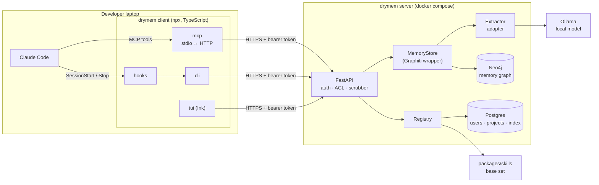
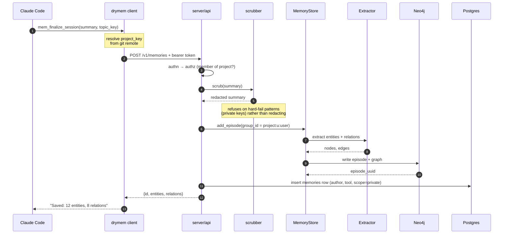
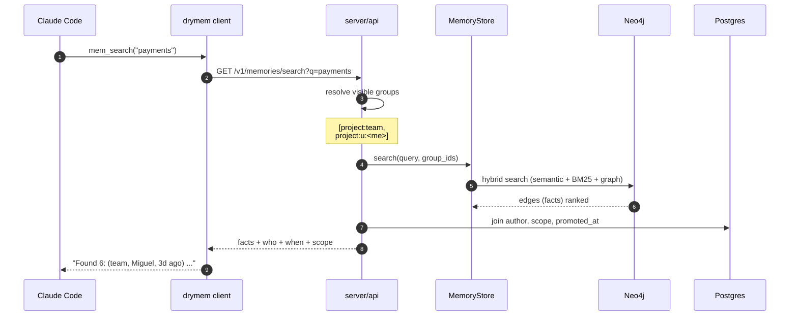
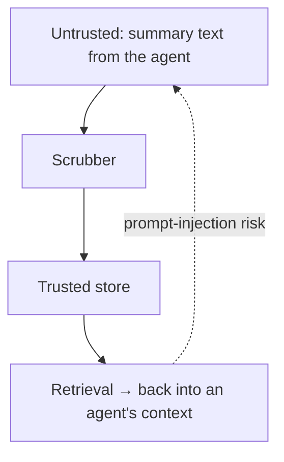
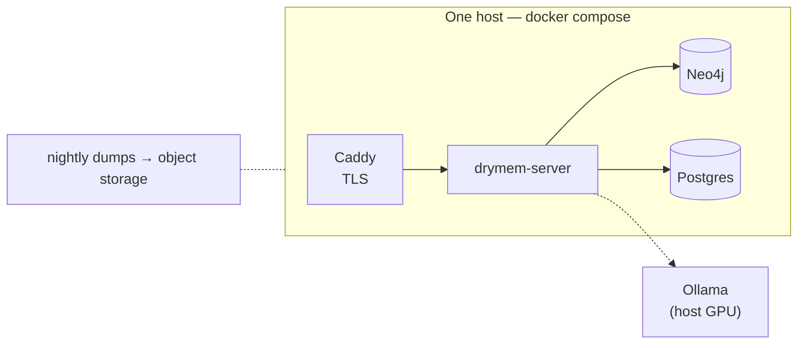

# drymem — Architecture

Companion to [PLAN.md](../PLAN.md). PLAN.md says *what* we build and in what
order; this document says *how the pieces fit* and is kept current as they land.

---

## 1. System overview



**The rule that keeps this honest:** nothing on the laptop imports `graphiti_core`
or `neo4j`, and no surface (MCP, CLI, TUI, hooks) talks to a database. They all
go through one `DrymemClient` over HTTP. That is what makes the client
installable with `npx` and the security boundary a single place.

### Component responsibilities

| Component | Owns | Never does |
|---|---|---|
| `apps/cli` · mcp | Exposing `mem_*` tools to Claude over stdio; forwarding to HTTP | Business logic, storage |
| `apps/cli` · cli | Human and hook entry points (`setup`, `save`, `search`, `promote`, `import`, `skills`) | Storage |
| `apps/cli` · tui | Browsing, search, rating, promotion | Storage |
| `apps/cli` · hooks | Shell shims Claude Code fires on session events | Anything slow or blocking |
| `apps/server` · api | Auth, project ACL, scrubbing, request validation | Talking to the LLM directly |
| `apps/server` · memory | `MemoryStore` — the only code that knows Graphiti exists | Knowing about HTTP |
| `apps/server` · extraction | Extractor adapters (Ollama, Fake, Anthropic) | Knowing about HTTP |
| `apps/server` · skills | Registry: which skill, which version, which project | Holding skill *content* (git does) |

---

## 2. Data flow — one save

`mem_finalize_session` is the hot path. The summary is written by Claude inside
the session; drymem never summarises a transcript (PLAN.md D6).



**Failure rule.** Extraction is the slow, fallible part. The episode is written
to Neo4j and the row to Postgres even if extraction returns nothing useful — a
memory with no extracted entities is still retrievable by recency and by text.
Losing the memory because the model hiccuped is not acceptable.

---

## 3. Data flow — one search



**Why the Postgres join matters.** A fact with no author and no date is a rumour.
Every retrieved memory carries who vouched for it and when, so the agent — and
the human reading the TUI — can weigh it.

---

## 4. Isolation model

One Neo4j `group_id` per visibility bucket. This is Graphiti's native isolation,
so we get it for free and it is the same mechanism at every tier.

```
<project_key>:team          promoted, visible to every project member
<project_key>:u:<user_id>   private to that user
```

- A search runs over `[team] + [own private]`. Never another user's private group.
- **Promotion re-ingests** the episode into the team group and stamps
  `memories.promoted_at`. The private original stays; the team copy is the shared one.
- `project_key` comes from the normalised git remote (PLAN.md D7), so two clones
  at different paths on different machines resolve to the same project.

At the SaaS tier this same mechanism scales two ways: small teams share one Neo4j
partitioned by `group_id`; enterprise clients get a dedicated Neo4j instance
(PLAN.md step 6).

---

## 5. Trust boundaries



Three boundaries worth naming, because each has a rule:

1. **Laptop → server.** Bearer token per user; project ACL on every request. A
   user reaching for a project they aren't a member of gets 404, not 403 — we
   don't confirm the project exists.
2. **Summary → store.** Everything passes the scrubber first. Secret patterns are
   redacted; a detected private key block **fails the save loudly** rather than
   being silently redacted, because a leaked key needs a human to know about it.
3. **Store → agent context.** Retrieved memories are text that goes back into a
   model's context. A memory is data, never instructions. The MCP tool output
   labels them as recalled memories so the agent treats them as context, not
   commands. This matters more once memories are shared: a teammate's memory is
   a second author in your context window.

---

## 6. Deployment



Only Caddy is exposed. Neo4j and Postgres bind to the compose network — never a
public port, which is the single most common way a Neo4j gets owned.

Two pilot options (PLAN.md step 4): Miguel's workstation over Tailscale (GPU
already there, €0), or the cheapest EU VPS. Same compose file either way.

---

## 7. What changes between steps

| After step | Architecture reality |
|---|---|
| 1 | Single user. No server: MCP process talks to local Neo4j + local Ollama. The `MemoryStore` interface exists, so step 2A moves it without touching tool logic. |
| 2A | Server exists. Client is TypeScript over HTTP. Neo4j and Postgres in compose on Miguel's machine. |
| 2B | TUI on the same client. |
| 3A | `scope` and promotion live. Multi-user for real. |
| 3B | Skills registry + git sync. |
| 4 | Deployed where teammates can reach it. |
| 6 | Multi-org; dedicated Neo4j per enterprise client. |
