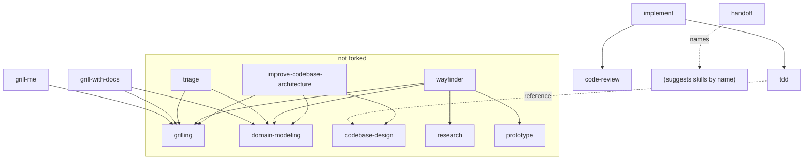

# Review — mattpocock/skills

All 37 skills read, 2026-09-10, at MIT license. This is the step 0 deliverable
from drymem's PLAN.md: confirm the structure, map the dependencies, choose a
base set.

## The structure, confirmed

Two kinds of skill, and the split is real:

- **Primitives** carry no invocation flag, so both the user and the model can
  invoke them. They are disciplines to consult, not sessions to run.
- **Orchestrators** carry `disable-model-invocation: true` and are often a
  handful of lines. `grill-with-docs` is, in full, seven lines whose body is
  *"Call the Skill tool twice, for `grilling` and `domain-modeling`."*

This is what makes the set worth forking. The value is not in any one skill; it
is that a long procedure is expressed as composition rather than as one long
document, so the pieces get reused and stay short.

## Correction to PLAN.md

The plan said primitives should get `user-invocable: false`. **Wrong** — no
skill in the repo sets it, and it would be a mistake to add. `ask-matt`
documents users invoking `/grilling` directly when they want the interview with
no wrapper. Leaving primitives invokable by both costs nothing and keeps that
door open. The only flag we set is `disable-model-invocation: true`, on
orchestrators and on anything with side effects.

## Dependency graph

**Selection follows the closure, not the category.** An orchestrator without its
primitives is a file that names skills you don't have. Taking `grill-with-docs`
means taking `grilling` and `domain-modeling`; taking `implement` means taking
`tdd` and `code-review`, and `tdd` in turn wants `codebase-design` for its
vocabulary.

## Base set — 17 skills

| Skill | Kind | Why |
|---|---|---|
| `grilling` | primitive | the interview loop; three dropped skills also run it, which is the strongest signal it is the real primitive |
| `domain-modeling` | primitive | keeps CONTEXT.md and ADRs honest |
| `grill-me`, `grill-with-docs` | orchestrator | the two named ways into `grilling` |
| `codebase-design` | primitive | deep-module vocabulary; `tdd` depends on it |
| `tdd` | primitive | red-green-refactor, with `tests.md` and `mocking.md` |
| `code-review` | primitive | two-axis review, standards + spec |
| `diagnosing-bugs` | primitive | refuses to theorise before a failing loop exists |
| `resolving-merge-conflicts` | primitive | small and self-contained |
| `research` | primitive | delegates reading to a background agent |
| `writing-for-agents` | primitive | style guide for writing skills — we need this to write our own |
| `to-spec`, `to-tickets`, `implement` | orchestrator | plan → tickets → build |
| `handoff` | orchestrator | rewired to `mem_finalize_session` in drymem step 3B |
| `wait-what` | orchestrator | seven lines, re-pitch the last message |
| `teach` | orchestrator | onboarding; four format docs alongside it |

## Not forked, and why

| Skill | Reason |
|---|---|
| `ask-matt` | a router over *his* set, and the personality we do not want. Its content is still the best map of how the flow fits together — worth reading once, not shipping |
| `setup-matt-pocock-skills` | configures a repo's issue tracker and doc layout. `drymem skills sync` replaces it |
| `triage`, `wayfinder` | assume an issue tracker with a label vocabulary. The team is deliberately tracker-agnostic |
| `improve-codebase-architecture` | generates an HTML report; heavier than the pilot needs |
| `prototype`, `wizard`, `to-questionnaire` | good, but niche. Add on demand |
| `in-progress/*` | his own words: in progress |
| `misc/*` | `shoehorn`, exercise scaffolding, his pre-commit setup — specific to his stack |

## Coupling we had to cut

Three skills asked the user to run `/setup-matt-pocock-skills` and read tracker
config from `docs/agents/issue-tracker.md`: `to-spec`, `to-tickets`,
`code-review`. All three now use markdown in the repo (`docs/specs/`,
`docs/tickets/`). See ATTRIBUTION.md.

That was the entire coupling. Fourteen of the seventeen forked skills needed no
edit at all — a good sign about how they were written.

## What we deliberately did not do

Improve them. The temptation is to rewrite prose that sounds like someone else,
but skills are instructions to a model and wording changes behaviour in ways
taste cannot predict. drymem's whole thesis is that improvements should come
from *evidence* — recurring problems in the team's memory — so we wait for
pilot data (step 5) rather than guessing now.
